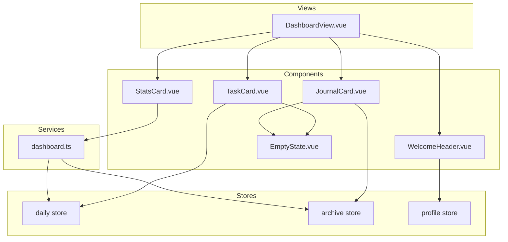

# 设计文档

## 概述

仪表盘首页（Dashboard）是"行动手帐"应用的核心入口页面，整合了用户的今日任务、最近日记和数据统计。该功能采用组件化设计，复用现有的 Pinia stores（daily、archive、profile）获取数据，使用玻璃拟态风格与登录页保持视觉一致性。

## 架构



## 组件和接口

### 1. DashboardView.vue

主视图组件，负责布局和数据加载协调。

```typescript
// 组件职责
// - 页面整体布局（响应式网格）
// - 协调子组件数据加载
// - 处理加载状态

interface DashboardViewProps {
  // 无 props，数据从 stores 获取
}
```

### 2. WelcomeHeader.vue

欢迎区域组件，显示问候语、昵称和日期。

```typescript
interface WelcomeHeaderProps {
  // 无 props，数据从 profile store 获取
}

// 导出的工具函数（用于测试）
export function getGreeting(hour: number): string
export function formatDate(date: Date): string
export function formatGreetingWithNickname(greeting: string, nickname: string | null): string
```

### 3. TaskCard.vue

今日任务卡片组件。

```typescript
interface TaskCardProps {
  // 无 props，数据从 daily store 获取
}

// 显示逻辑
// - 最多显示 5 个任务
// - 超过 5 个显示"查看全部"链接
// - 无任务显示空状态
```

### 4. JournalCard.vue

最近日记卡片组件。

```typescript
interface JournalCardProps {
  // 无 props，数据从 archive store 获取
}

// 导出的工具函数（用于测试）
export function formatJournalPreview(journal: string, maxLength?: number): string
export function getMoodEmoji(mood: MoodType | null): string

// 显示逻辑
// - 最多显示 3 条日记
// - 超过 3 条显示"查看全部"链接
// - 无日记显示空状态
```

### 5. StatsCard.vue

数据概览卡片组件。

```typescript
interface StatsCardProps {
  weeklyCompletedTasks: number
  weeklyJournalDays: number
  consecutiveDays: number
}
```

### 6. EmptyState.vue

通用空状态组件。

```typescript
interface EmptyStateProps {
  icon: string           // emoji 图标
  message: string        // 引导文案
  actionText: string     // 按钮文字
  actionRoute: string    // 跳转路由
}
```

### 7. dashboard.ts (Service)

仪表盘数据服务，提供统计计算逻辑。

```typescript
// 接口定义
interface WeeklyStats {
  completedTasks: number    // 本周完成任务数
  journalDays: number       // 本周写日记天数
  consecutiveDays: number   // 连续打卡天数
}

// 导出函数
export function calculateWeeklyStats(
  records: DailyRecord[],
  referenceDate?: Date
): WeeklyStats

export function getWeekDateRange(referenceDate?: Date): { start: Date; end: Date }

export function calculateConsecutiveDays(
  records: DailyRecord[],
  referenceDate?: Date
): number
```

## 数据模型

### 复用现有类型

```typescript
// 来自 src/types/index.ts
interface Task {
  id: string
  description: string
  completed: boolean
  priority: Priority
  tags: string[]
  order: number
  createdAt: string
  completedAt: string | null
}

interface DailyRecord {
  id: string
  date: string
  tasks: Task[]
  journal: string
  mood: MoodType | null
  isSealed: boolean
  completionRate: number
  createdAt: string
  sealedAt: string | null
}

type MoodType = 'happy' | 'neutral' | 'sad' | 'excited' | 'tired'
```

### 心情 Emoji 映射

```typescript
const MOOD_EMOJI_MAP: Record<MoodType, string> = {
  happy: '😊',
  neutral: '😐',
  sad: '😢',
  excited: '🤩',
  tired: '😴'
}
```

## 正确性属性

*属性是系统在所有有效执行中应保持为真的特征或行为——本质上是关于系统应该做什么的形式化陈述。属性作为人类可读规范和机器可验证正确性保证之间的桥梁。*

### Property 1: 时间段到问候语映射

*对于任意* 0-23 范围内的小时值，getGreeting 函数应返回正确的问候语：
- 0-11 返回"早上好"
- 12-17 返回"下午好"  
- 18-23 返回"晚上好"

**Validates: Requirements 1.1, 1.2, 1.3**

### Property 2: 问候语与昵称组合

*对于任意* 非空昵称字符串，formatGreetingWithNickname 函数应返回包含问候语和昵称的组合字符串（格式为"问候语，昵称"）

**Validates: Requirements 1.4**

### Property 3: 日期格式化

*对于任意* 有效的 Date 对象，formatDate 函数应返回格式为"YYYY年M月D日 星期X"的字符串，其中星期对应正确的中文星期名称

**Validates: Requirements 1.6**

### Property 4: 任务列表截取

*对于任意* 长度的任务数组，显示的任务数量应不超过 5，且当原始数组长度大于 5 时应显示"查看全部"链接

**Validates: Requirements 2.1, 2.2**

### Property 5: 任务完成进度格式

*对于任意* 非空任务数组，进度显示应为"X/Y 已完成"格式，其中 X 为已完成任务数，Y 为总任务数

**Validates: Requirements 2.4**

### Property 6: 日记列表截取和排序

*对于任意* 已封存日记记录数组，显示的日记数量应不超过 3，且按日期降序排列（最新的在前），当原始数组长度大于 3 时应显示"查看全部"链接

**Validates: Requirements 3.1, 3.3**

### Property 7: 日记摘要格式化

*对于任意* 日记内容字符串，formatJournalPreview 函数应返回不超过指定长度的预览文本，超出部分用省略号表示

**Validates: Requirements 3.2**

### Property 8: 本周统计计算

*对于任意* 日记记录数组和参考日期，calculateWeeklyStats 函数应正确计算：
- 本周（周一到周日）内完成的任务总数
- 本周内有日记记录的天数

**Validates: Requirements 4.1, 4.2**

### Property 9: 连续打卡天数计算

*对于任意* 按日期排序的日记记录数组，calculateConsecutiveDays 函数应返回从参考日期向前连续有记录的天数

**Validates: Requirements 4.3**

## 错误处理

### 数据加载错误

- 当 store 数据加载失败时，显示友好的错误提示
- 提供重试按钮让用户手动刷新数据
- 使用 localStorage 缓存作为后备数据源

### 边界情况

- 空任务列表：显示 EmptyState 组件
- 空日记列表：显示 EmptyState 组件
- 用户未设置昵称：仅显示问候语，不显示逗号
- 统计数据为 0：正常显示数字 0

## 测试策略

### 单元测试

使用 Vitest 进行单元测试：

1. **工具函数测试**
   - `getGreeting` 函数的时间段映射
   - `formatDate` 函数的日期格式化
   - `formatJournalPreview` 函数的文本截取
   - `getMoodEmoji` 函数的心情映射
   - `calculateWeeklyStats` 函数的统计计算
   - `calculateConsecutiveDays` 函数的连续天数计算

2. **组件测试**
   - 各组件的渲染和交互
   - 空状态的显示逻辑
   - 路由跳转功能

### 属性测试

使用 fast-check 进行属性测试：

1. **Property 1**: 时间段到问候语映射
   - 生成 0-23 的随机小时值
   - 验证返回的问候语符合时间段规则

2. **Property 2**: 问候语与昵称组合
   - 生成随机非空字符串作为昵称
   - 验证输出包含问候语和昵称

3. **Property 3**: 日期格式化
   - 生成随机有效日期
   - 验证输出格式正确且星期对应正确

4. **Property 4**: 任务列表截取
   - 生成随机长度的任务数组
   - 验证显示数量不超过 5

5. **Property 5**: 任务完成进度格式
   - 生成随机任务数组（包含不同完成状态）
   - 验证进度格式正确

6. **Property 6**: 日记列表截取和排序
   - 生成随机日记记录数组
   - 验证显示数量不超过 3 且按日期降序

7. **Property 7**: 日记摘要格式化
   - 生成随机长度的字符串
   - 验证输出长度不超过限制

8. **Property 8**: 本周统计计算
   - 生成随机日记记录和参考日期
   - 验证统计结果正确

9. **Property 9**: 连续打卡天数计算
   - 生成随机日期序列的日记记录
   - 验证连续天数计算正确

### 测试标注格式

每个属性测试必须使用以下格式标注：

```typescript
/**
 * **Feature: dashboard, Property 1: 时间段到问候语映射**
 * **Validates: Requirements 1.1, 1.2, 1.3**
 */
```

### 测试配置

- 属性测试最少运行 100 次迭代
- 使用 fast-check 作为属性测试库
