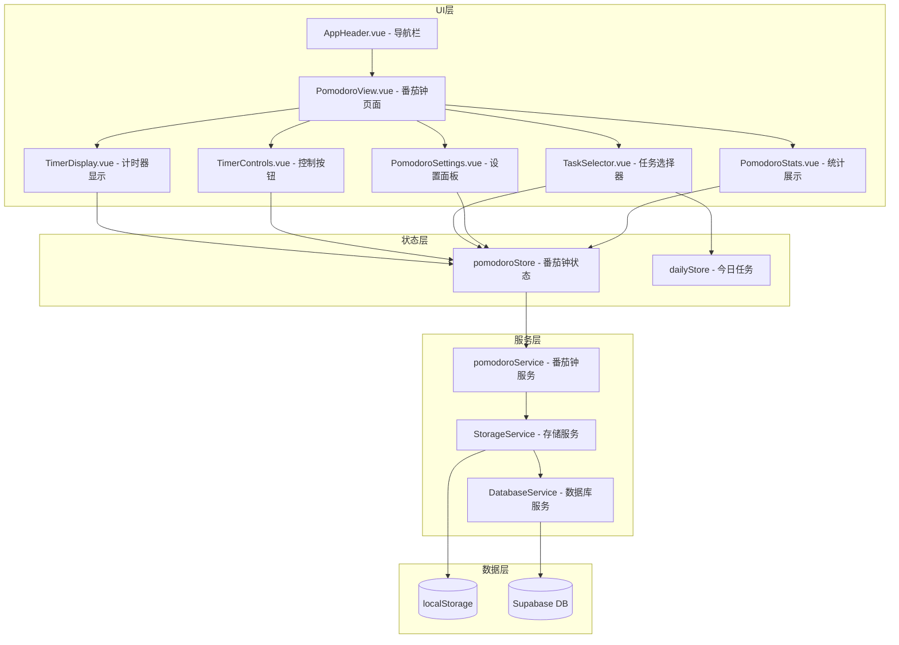

# 设计文档

## 概述

番茄钟功能为行动手帐应用提供专注计时能力，帮助用户使用番茄工作法管理时间。该功能包括计时器控制、任务关联、自定义设置和专注统计。系统采用与现有架构一致的 Vue 3 + Pinia + TypeScript 技术栈，支持本地存储和数据库同步。

## 架构



## 组件和接口

### 1. 路由配置

在 `src/router/index.ts` 中添加番茄钟路由：

```typescript
{
  path: '/pomodoro',
  name: 'pomodoro',
  component: () => import('@/views/PomodoroView.vue'),
  meta: { title: '番茄钟', requiresAuth: true }
}
```

### 2. 导航栏更新

在 `AppHeader.vue` 的 `navItems` 中添加番茄钟入口：

```typescript
{ path: '/pomodoro', name: 'pomodoro', label: '专注', icon: '🍅' }
```

### 3. 核心组件

#### PomodoroView.vue
- 番茄钟主页面，整合所有子组件
- 管理页面级别的状态和交互

#### TimerDisplay.vue
- 显示圆形进度指示器
- 显示剩余时间（MM:SS 格式）
- 根据模式（专注/休息）切换颜色

#### TimerControls.vue
- 开始/暂停/继续按钮
- 重置按钮
- 根据计时器状态显示不同按钮

#### TaskSelector.vue
- 显示今日未完成任务列表
- 支持选择/取消选择任务
- 显示当前关联的任务名称

#### PomodoroSettings.vue
- 专注时长设置（1-60 分钟）
- 短休息时长设置（1-30 分钟）
- 长休息时长设置（1-30 分钟）
- 输入验证和保存功能

#### PomodoroStats.vue
- 今日完成的专注时段数量
- 今日累计专注时长

### 4. Store 接口

```typescript
// src/stores/pomodoro.ts
interface PomodoroState {
  // 计时器状态
  timerState: TimerState           // 'idle' | 'focusing' | 'break' | 'paused'
  currentMode: TimerMode           // 'focus' | 'shortBreak' | 'longBreak'
  remainingSeconds: number         // 剩余秒数
  totalSeconds: number             // 当前模式总秒数
  
  // 专注统计
  completedPomodoros: number       // 今日完成的专注时段数
  totalFocusMinutes: number        // 今日累计专注分钟数
  
  // 任务关联
  selectedTaskId: string | null    // 当前关联的任务 ID
  
  // 设置
  settings: PomodoroSettings       // 时长配置
  
  // 专注记录
  todayRecords: FocusRecord[]      // 今日专注记录
}

interface PomodoroActions {
  // 计时器控制
  start(): void
  pause(): void
  resume(): void
  reset(): void
  
  // 任务关联
  selectTask(taskId: string | null): void
  
  // 设置
  updateSettings(settings: Partial<PomodoroSettings>): boolean
  
  // 数据加载
  loadTodayData(): Promise<void>
}
```

### 5. 服务接口

```typescript
// src/services/pomodoro.ts
interface PomodoroService {
  // 专注记录持久化
  saveFocusRecord(record: FocusRecord): Promise<{ success: boolean }>
  loadTodayRecords(): Promise<{ success: boolean; data: FocusRecord[] }>
  
  // 设置持久化
  saveSettings(settings: PomodoroSettings): { success: boolean }
  loadSettings(): { success: boolean; data: PomodoroSettings }
}
```

## 数据模型

### 类型定义

```typescript
// 添加到 src/types/index.ts

/**
 * 计时器状态
 */
export type TimerState = 'idle' | 'focusing' | 'break' | 'paused'

/**
 * 计时器模式
 */
export type TimerMode = 'focus' | 'shortBreak' | 'longBreak'

/**
 * 番茄钟设置
 */
export interface PomodoroSettings {
  focusDuration: number      // 专注时长（分钟），默认 25，范围 1-60
  shortBreakDuration: number // 短休息时长（分钟），默认 5，范围 1-30
  longBreakDuration: number  // 长休息时长（分钟），默认 15，范围 1-30
  pomodorosUntilLongBreak: number // 长休息前的专注次数，默认 4
}

/**
 * 专注记录
 */
export interface FocusRecord {
  id: string                 // UUID
  taskId: string | null      // 关联的任务 ID
  taskDescription: string | null // 任务描述快照
  duration: number           // 实际专注时长（分钟）
  completedAt: string        // 完成时间 (ISO 8601)
  date: string               // 日期 (YYYY-MM-DD)
}

/**
 * 番茄钟默认设置
 */
export const DEFAULT_POMODORO_SETTINGS: PomodoroSettings = {
  focusDuration: 25,
  shortBreakDuration: 5,
  longBreakDuration: 15,
  pomodorosUntilLongBreak: 4
}
```

### 数据库表结构

```sql
-- 专注记录表
CREATE TABLE focus_records (
  id UUID PRIMARY KEY DEFAULT gen_random_uuid(),
  task_id UUID REFERENCES tasks(id) ON DELETE SET NULL,
  task_description TEXT,
  duration INTEGER NOT NULL,           -- 专注时长（分钟）
  completed_at TIMESTAMPTZ NOT NULL,
  date DATE NOT NULL,
  user_id UUID REFERENCES auth.users(id) NOT NULL,
  created_at TIMESTAMPTZ DEFAULT NOW()
);

-- 启用 RLS
ALTER TABLE focus_records ENABLE ROW LEVEL SECURITY;

-- RLS 策略：用户只能访问自己的记录
CREATE POLICY "用户只能查看自己的专注记录" ON focus_records
  FOR SELECT TO authenticated
  USING (user_id = auth.uid());

CREATE POLICY "用户只能创建自己的专注记录" ON focus_records
  FOR INSERT TO authenticated
  WITH CHECK (user_id = auth.uid());

-- 索引优化
CREATE INDEX idx_focus_records_user_date ON focus_records(user_id, date);
```


## 正确性属性

*属性是系统在所有有效执行中应保持为真的特征或行为——本质上是关于系统应该做什么的形式化陈述。属性作为人类可读规范和机器可验证正确性保证之间的桥梁。*

### 属性 1：计时器状态转换一致性

*对于任意*计时器状态和操作，状态转换应遵循以下规则：
- 空闲状态 + 开始 → 运行状态
- 运行状态 + 暂停 → 暂停状态（剩余时间不变）
- 暂停状态 + 继续 → 运行状态（从暂停位置继续）
- 任意状态 + 重置 → 空闲状态（时间重置为初始值）

**Validates: Requirements 2.1, 2.2, 2.3, 2.4**

### 属性 2：计时器倒计时递减

*对于任意*运行中的计时器，经过 1 秒后，剩余时间应减少 1 秒（除非已到达 0）。

**Validates: Requirements 2.5**

### 属性 3：专注完成后模式切换

*对于任意*完成的专注时段：
- 如果已完成的专注次数 < 4，则切换到短休息模式
- 如果已完成的专注次数 = 4，则切换到长休息模式并重置计数

**Validates: Requirements 3.2, 3.3, 3.4**

### 属性 4：休息完成后恢复专注

*对于任意*完成的休息时段（短休息或长休息），系统应自动切换回专注模式。

**Validates: Requirements 3.5**

### 属性 5：任务关联记录一致性

*对于任意*关联了任务的专注时段，完成后创建的专注记录应包含正确的任务 ID 和任务描述。

**Validates: Requirements 4.2, 4.4**

### 属性 6：设置值验证

*对于任意*设置值：
- 专注时长在 1-60 分钟范围内的整数应被接受
- 休息时长在 1-30 分钟范围内的整数应被接受
- 超出范围的值应被拒绝

**Validates: Requirements 5.2, 5.3, 5.5**

### 属性 7：设置持久化往返一致性

*对于任意*有效的设置配置，保存后重新加载应得到相同的配置值。

**Validates: Requirements 5.4**

### 属性 8：专注记录持久化往返一致性

*对于任意*完成的专注记录，保存到本地存储后重新加载应得到相同的记录数据。

**Validates: Requirements 7.1, 7.3**

### 属性 9：统计数据实时更新

*对于任意*完成的专注时段，完成后统计数据（完成次数和累计时长）应立即反映该时段。

**Validates: Requirements 6.3**

## 错误处理

### 计时器错误

| 错误场景 | 处理方式 |
|---------|---------|
| 浏览器标签页失去焦点 | 使用 `requestAnimationFrame` 或 `setInterval` 保持计时，切回时校正时间 |
| 页面刷新 | 不保存进行中的计时状态，重新开始 |

### 设置验证错误

| 错误场景 | 错误消息 |
|---------|---------|
| 专注时长超出范围 | "专注时长需在 1-60 分钟之间" |
| 休息时长超出范围 | "休息时长需在 1-30 分钟之间" |
| 非整数输入 | "请输入整数" |

### 存储错误

| 错误场景 | 处理方式 |
|---------|---------|
| localStorage 不可用 | 仅在内存中保存，提示用户数据不会持久化 |
| 数据库连接失败 | 回退到 localStorage，后台重试同步 |
| 存储配额超限 | 提示用户清理历史数据 |

## 测试策略

### 单元测试

使用 Vitest 进行单元测试：

1. **Store 测试** (`src/stores/pomodoro.test.ts`)
   - 计时器状态转换
   - 设置验证逻辑
   - 统计计算

2. **Service 测试** (`src/services/pomodoro.test.ts`)
   - 数据持久化
   - 设置加载/保存

3. **组件测试**
   - TimerDisplay 渲染
   - TimerControls 交互
   - TaskSelector 选择逻辑

### 属性测试

使用 fast-check 进行属性测试：

1. **计时器状态机测试**
   - 生成随机的操作序列
   - 验证状态转换符合规则

2. **设置验证测试**
   - 生成随机的设置值
   - 验证边界条件处理

3. **持久化往返测试**
   - 生成随机的专注记录
   - 验证保存后加载的一致性

### 测试配置

```typescript
// 属性测试最少运行 100 次迭代
fc.assert(
  fc.property(...),
  { numRuns: 100 }
)
```

### 测试标注格式

每个属性测试必须使用以下格式标注：

```typescript
/**
 * **Feature: pomodoro-timer, Property 1: 计时器状态转换一致性**
 */
```
