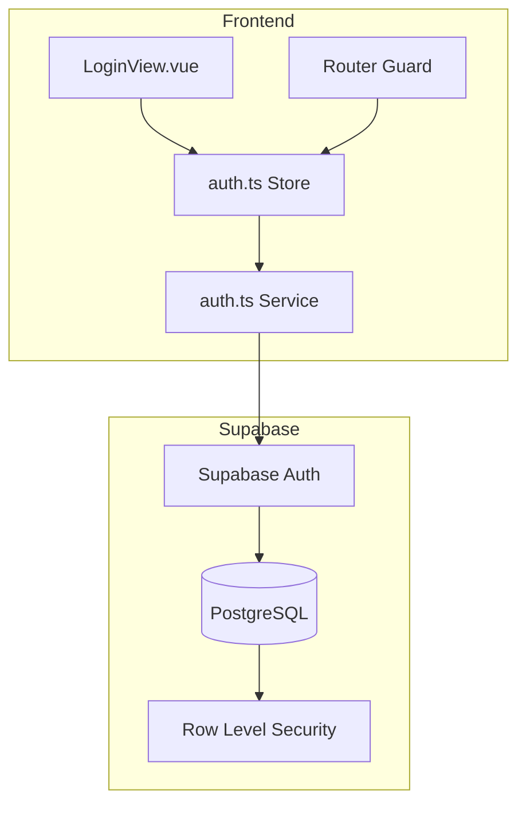
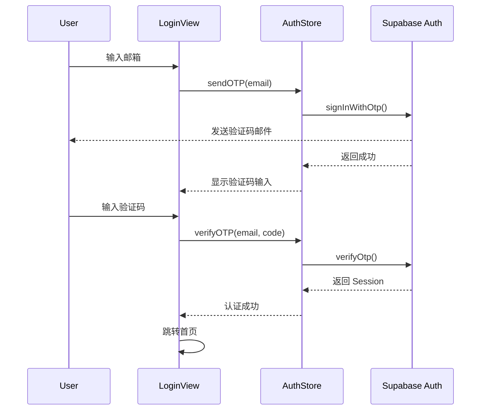

# Design Document: User Authentication

## Overview

本设计文档描述行动手帐应用的用户认证系统实现方案。系统采用 Supabase Auth 提供的 OTP（一次性密码）认证方式，通过邮箱验证码实现无密码登录体验。

### 核心特性
- 邮箱 + 验证码认证（无密码）
- 会话持久化与自动刷新
- 用户数据隔离（RLS）
- 玻璃拟态 UI 设计
- 响应式布局

## Architecture



### 认证流程



## Components and Interfaces

### 1. AuthService (src/services/auth.ts)

```typescript
interface AuthService {
  // 发送验证码
  sendOTP(email: string): Promise<AuthResult>
  
  // 验证验证码
  verifyOTP(email: string, token: string): Promise<AuthResult<Session>>
  
  // 获取当前会话
  getSession(): Promise<Session | null>
  
  // 登出
  signOut(): Promise<AuthResult>
  
  // 监听认证状态变化
  onAuthStateChange(callback: AuthStateCallback): Unsubscribe
}

interface AuthResult<T = void> {
  success: boolean
  data?: T
  error?: AuthError
}

interface AuthError {
  code: string
  message: string
}
```

### 2. AuthStore (src/stores/auth.ts)

```typescript
interface AuthState {
  user: User | null
  session: Session | null
  isLoading: boolean
  isAuthenticated: boolean
  error: string | null
}

interface AuthActions {
  sendOTP(email: string): Promise<boolean>
  verifyOTP(email: string, code: string): Promise<boolean>
  signOut(): Promise<void>
  initialize(): Promise<void>
  clearError(): void
}
```

### 3. LoginView (src/views/LoginView.vue)

```typescript
interface LoginViewState {
  mode: 'login' | 'register'
  step: 'email' | 'verify'
  email: string
  verificationCode: string[]
  countdown: number
  isSubmitting: boolean
}
```

### 4. VerificationCodeInput Component

```typescript
interface VerificationCodeInputProps {
  modelValue: string[]
  length: number
  disabled: boolean
}

interface VerificationCodeInputEmits {
  'update:modelValue': (value: string[]) => void
  'complete': (code: string) => void
}
```

## Data Models

### User Type Extension

```typescript
// src/types/index.ts 新增
interface AuthUser {
  id: string              // Supabase user UUID
  email: string           // 用户邮箱
  createdAt: string       // 注册时间
  lastSignInAt: string    // 最后登录时间
}

interface Session {
  accessToken: string
  refreshToken: string
  expiresAt: number
  user: AuthUser
}
```

### Database Schema Updates

```sql
-- 为现有表添加 user_id 列
ALTER TABLE daily_records ADD COLUMN user_id UUID REFERENCES auth.users(id);
ALTER TABLE tasks ADD COLUMN user_id UUID REFERENCES auth.users(id);

-- 创建索引
CREATE INDEX idx_daily_records_user_id ON daily_records(user_id);
CREATE INDEX idx_tasks_user_id ON tasks(user_id);

-- Row Level Security 策略
ALTER TABLE daily_records ENABLE ROW LEVEL SECURITY;
ALTER TABLE tasks ENABLE ROW LEVEL SECURITY;

-- 用户只能访问自己的数据
CREATE POLICY "Users can only access own records" ON daily_records
  FOR ALL USING (auth.uid() = user_id);

CREATE POLICY "Users can only access own tasks" ON tasks
  FOR ALL USING (auth.uid() = user_id);
```


## Correctness Properties

*A property is a characteristic or behavior that should hold true across all valid executions of a system-essentially, a formal statement about what the system should do. Properties serve as the bridge between human-readable specifications and machine-verifiable correctness guarantees.*

### Property 1: Email Validation Rejects Invalid Formats
*For any* string that does not match a valid email pattern (missing @, invalid domain, etc.), the email validation function SHALL return false and prevent form submission.
**Validates: Requirements 1.2**

### Property 2: Session Persistence Round Trip
*For any* valid session stored in local storage, reloading the application SHALL restore the same session with matching user ID and tokens.
**Validates: Requirements 3.1, 3.4**

### Property 3: Logout Clears All Session Data
*For any* authenticated user, calling signOut SHALL result in: session being null, user being null, and local storage containing no session data.
**Validates: Requirements 4.1, 4.2**

### Property 4: User Data Isolation
*For any* logged-in user creating a daily record, the record's user_id SHALL equal the authenticated user's ID, and queries SHALL return only records with matching user_id.
**Validates: Requirements 5.1, 5.2**

### Property 5: Loading State During Async Operations
*For any* async authentication operation (sendOTP or verifyOTP), the isLoading state SHALL be true while the operation is in progress and false after completion.
**Validates: Requirements 6.1, 6.2**

### Property 6: Error Messages in Chinese
*For any* authentication error, the displayed error message SHALL contain Chinese characters and be user-friendly (not raw error codes).
**Validates: Requirements 6.3**

### Property 7: Verification Code Auto-Focus Forward
*For any* digit input in verification code boxes (positions 0-4), entering a digit SHALL automatically focus the next input box.
**Validates: Requirements 8.1**

### Property 8: Verification Code Backspace Focus
*For any* empty verification code input box (positions 1-5), pressing backspace SHALL focus the previous input box.
**Validates: Requirements 8.2**

### Property 9: Verification Code Paste Distribution
*For any* 6-digit numeric string pasted into the verification code input, the digits SHALL be distributed across all 6 input boxes in order.
**Validates: Requirements 8.3**

### Property 10: Verification Code Auto-Submit
*For any* state where all 6 verification code digits are filled, the system SHALL automatically trigger the verification submission.
**Validates: Requirements 8.4**

### Property 11: Countdown Timer Decrement
*For any* active countdown timer with value N > 0, after 1 second the countdown value SHALL be N - 1.
**Validates: Requirements 8.5**

## Error Handling

### Error Types and Messages

| Error Code | Chinese Message | Scenario |
|------------|-----------------|----------|
| `INVALID_EMAIL` | 请输入有效的邮箱地址 | 邮箱格式不正确 |
| `EMAIL_NOT_FOUND` | 该邮箱尚未注册 | 登录时邮箱不存在 |
| `EMAIL_EXISTS` | 该邮箱已被注册 | 注册时邮箱已存在 |
| `INVALID_OTP` | 验证码错误，请重新输入 | 验证码不匹配 |
| `OTP_EXPIRED` | 验证码已过期，请重新获取 | 验证码超时 |
| `RATE_LIMIT` | 请求过于频繁，请稍后再试 | 触发限流 |
| `NETWORK_ERROR` | 网络连接失败，请检查网络 | 网络问题 |
| `UNKNOWN_ERROR` | 操作失败，请稍后重试 | 未知错误 |

### Error Handling Strategy

```typescript
function mapSupabaseError(error: AuthError): string {
  const errorMap: Record<string, string> = {
    'invalid_email': '请输入有效的邮箱地址',
    'user_not_found': '该邮箱尚未注册',
    'email_exists': '该邮箱已被注册',
    'invalid_otp': '验证码错误，请重新输入',
    'otp_expired': '验证码已过期，请重新获取',
    'over_request_rate_limit': '请求过于频繁，请稍后再试'
  }
  return errorMap[error.code] || '操作失败，请稍后重试'
}
```

## Testing Strategy

### Testing Framework
- **Unit Testing**: Vitest
- **Property-Based Testing**: fast-check
- **Component Testing**: @vue/test-utils

### Unit Tests

1. **AuthService Tests**
   - `sendOTP` returns success for valid email
   - `sendOTP` returns error for invalid email
   - `verifyOTP` returns session on success
   - `verifyOTP` returns error on invalid code
   - `signOut` clears session

2. **AuthStore Tests**
   - State transitions during authentication flow
   - Error state management
   - Session initialization on app load

3. **VerificationCodeInput Tests**
   - Renders 6 input boxes
   - Focus management on digit entry
   - Paste handling

### Property-Based Tests

Each correctness property will be implemented as a property-based test using fast-check:

```typescript
// Example: Property 1 - Email Validation
import * as fc from 'fast-check'

test('Property 1: Email validation rejects invalid formats', () => {
  fc.assert(
    fc.property(
      fc.string().filter(s => !s.includes('@') || !s.includes('.')),
      (invalidEmail) => {
        expect(validateEmail(invalidEmail)).toBe(false)
      }
    ),
    { numRuns: 100 }
  )
})
```

### Test File Structure

```
src/
├── services/
│   └── auth.test.ts          # AuthService unit + property tests
├── stores/
│   └── auth.test.ts          # AuthStore unit tests
├── components/
│   └── auth/
│       └── VerificationCodeInput.test.ts  # Component tests
└── views/
    └── LoginView.test.ts     # Integration tests
```

