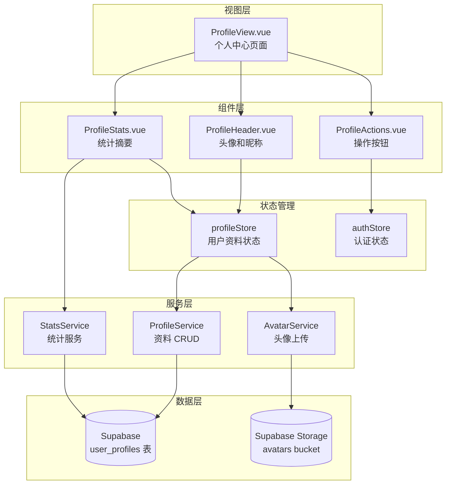

# 设计文档

## 概述

个人中心功能为行动手帐应用提供用户资料管理能力。该功能允许用户查看和编辑个人信息（昵称、头像），查看账户统计数据，以及安全退出登录。所有用户数据通过 Supabase 数据库持久化存储。

## 架构



## 组件和接口

### 视图组件

#### ProfileView.vue
个人中心主页面，整合所有子组件。

```typescript
// 路由配置
{
  path: '/profile',
  name: 'Profile',
  component: ProfileView,
  meta: { requiresAuth: true }
}
```

### UI 组件

#### ProfileHeader.vue
显示和编辑用户头像、昵称。

```typescript
interface ProfileHeaderProps {
  // 无需 props，从 store 获取数据
}

interface ProfileHeaderEmits {
  (e: 'avatar-updated', url: string): void
  (e: 'nickname-updated', nickname: string): void
}
```

#### ProfileStats.vue
显示用户使用统计摘要。

```typescript
interface ProfileStatsProps {
  completedTasks: number      // 已完成任务数
  consecutiveDays: number     // 连续打卡天数
  sealedRecords: number       // 已封存记录数
}
```

#### ProfileActions.vue
操作按钮区域（退出登录等）。

```typescript
interface ProfileActionsEmits {
  (e: 'sign-out'): void
}
```

### 服务接口

#### ProfileService
用户资料 CRUD 操作。

```typescript
interface ProfileService {
  // 获取用户资料
  getProfile(userId: string): Promise<ProfileResult<UserProfile>>
  
  // 更新用户资料
  updateProfile(userId: string, data: Partial<UserProfile>): Promise<ProfileResult<UserProfile>>
  
  // 更新昵称
  updateNickname(userId: string, nickname: string): Promise<ProfileResult<void>>
}

type ProfileResult<T> = 
  | { success: true; data: T }
  | { success: false; error: ProfileError }

interface ProfileError {
  code: string
  message: string
}
```

#### AvatarService
头像上传服务。

```typescript
interface AvatarService {
  // 上传头像
  uploadAvatar(userId: string, file: File): Promise<AvatarResult>
  
  // 删除头像
  deleteAvatar(userId: string): Promise<AvatarResult>
  
  // 验证文件
  validateFile(file: File): ValidationResult
}

type AvatarResult = 
  | { success: true; url: string }
  | { success: false; error: AvatarError }

interface ValidationResult {
  valid: boolean
  error?: string
}
```

## 数据模型

### UserProfile 类型

```typescript
/**
 * 用户资料接口
 */
interface UserProfile {
  id: string              // 用户 ID (与 auth.users.id 关联)
  email: string           // 邮箱（只读，来自 auth）
  nickname: string | null // 昵称
  avatarUrl: string | null // 头像 URL
  createdAt: string       // 注册时间 (ISO 8601)
  updatedAt: string       // 更新时间 (ISO 8601)
}
```

### 数据库表结构

```sql
-- 用户资料表
CREATE TABLE user_profiles (
  id UUID PRIMARY KEY REFERENCES auth.users(id) ON DELETE CASCADE,
  nickname TEXT,
  avatar_url TEXT,
  created_at TIMESTAMPTZ DEFAULT NOW(),
  updated_at TIMESTAMPTZ DEFAULT NOW()
);

-- 更新时间触发器
CREATE OR REPLACE FUNCTION update_updated_at()
RETURNS TRIGGER AS $$
BEGIN
  NEW.updated_at = NOW();
  RETURN NEW;
END;
$$ LANGUAGE plpgsql;

CREATE TRIGGER user_profiles_updated_at
  BEFORE UPDATE ON user_profiles
  FOR EACH ROW
  EXECUTE FUNCTION update_updated_at();

-- RLS 策略
ALTER TABLE user_profiles ENABLE ROW LEVEL SECURITY;

CREATE POLICY "用户只能查看自己的资料"
  ON user_profiles FOR SELECT
  USING (auth.uid() = id);

CREATE POLICY "用户只能更新自己的资料"
  ON user_profiles FOR UPDATE
  USING (auth.uid() = id);

CREATE POLICY "用户只能插入自己的资料"
  ON user_profiles FOR INSERT
  WITH CHECK (auth.uid() = id);
```

### Supabase Storage 配置

```sql
-- 创建头像存储桶
INSERT INTO storage.buckets (id, name, public)
VALUES ('avatars', 'avatars', true);

-- 存储策略
CREATE POLICY "用户可以上传自己的头像"
  ON storage.objects FOR INSERT
  WITH CHECK (
    bucket_id = 'avatars' AND
    auth.uid()::text = (storage.foldername(name))[1]
  );

CREATE POLICY "任何人可以查看头像"
  ON storage.objects FOR SELECT
  USING (bucket_id = 'avatars');

CREATE POLICY "用户可以删除自己的头像"
  ON storage.objects FOR DELETE
  USING (
    bucket_id = 'avatars' AND
    auth.uid()::text = (storage.foldername(name))[1]
  );
```

## 正确性属性

*属性是指在系统所有有效执行中都应保持为真的特征或行为——本质上是关于系统应该做什么的形式化陈述。属性是人类可读规范与机器可验证正确性保证之间的桥梁。*

基于预分析，以下是可测试的正确性属性：

### 属性 1: 昵称显示逻辑
*对于任意* 用户资料，如果昵称为空或 null，则显示"未设置昵称"；否则显示实际昵称值。
**验证: 需求 1.2**

### 属性 2: 头像显示逻辑
*对于任意* 用户资料，如果头像 URL 为空或 null，则显示默认头像；否则显示实际头像。
**验证: 需求 1.3**

### 属性 3: 有效昵称保存
*对于任意* 1-20 字符的非空白字符串，昵称验证应返回有效，且保存后应能正确读取相同值。
**验证: 需求 2.2**

### 属性 4: 空白昵称拒绝
*对于任意* 仅由空白字符组成的字符串（包括空字符串），昵称验证应返回无效。
**验证: 需求 2.3**

### 属性 5: 超长昵称拒绝
*对于任意* 超过 20 个字符的字符串，昵称验证应返回无效并提示长度限制。
**验证: 需求 2.4**

### 属性 6: 无效文件格式拒绝
*对于任意* 非 JPG/PNG 格式的文件，头像验证应返回格式错误。
**验证: 需求 3.3**

### 属性 7: 用户资料往返一致性
*对于任意* 有效的用户资料对象，序列化到数据库后再反序列化，应得到等价的对象。
**验证: 需求 5.1, 5.4**

## 错误处理

### 错误码定义

```typescript
const ProfileErrorCodes = {
  // 验证错误
  NICKNAME_EMPTY: 'PROFILE_NICKNAME_EMPTY',
  NICKNAME_TOO_LONG: 'PROFILE_NICKNAME_TOO_LONG',
  
  // 头像错误
  AVATAR_INVALID_FORMAT: 'PROFILE_AVATAR_INVALID_FORMAT',
  AVATAR_TOO_LARGE: 'PROFILE_AVATAR_TOO_LARGE',
  AVATAR_UPLOAD_FAILED: 'PROFILE_AVATAR_UPLOAD_FAILED',
  
  // 数据库错误
  DB_CONNECTION_ERROR: 'PROFILE_DB_CONNECTION_ERROR',
  DB_QUERY_ERROR: 'PROFILE_DB_QUERY_ERROR',
  NOT_FOUND: 'PROFILE_NOT_FOUND',
  AUTH_REQUIRED: 'PROFILE_AUTH_REQUIRED'
} as const
```

### 错误消息映射

```typescript
const errorMessages: Record<string, string> = {
  PROFILE_NICKNAME_EMPTY: '昵称不能为空',
  PROFILE_NICKNAME_TOO_LONG: '昵称不能超过20个字符',
  PROFILE_AVATAR_INVALID_FORMAT: '请选择 JPG 或 PNG 格式的图片',
  PROFILE_AVATAR_TOO_LARGE: '图片大小不能超过 5MB',
  PROFILE_AVATAR_UPLOAD_FAILED: '头像上传失败，请重试',
  PROFILE_DB_CONNECTION_ERROR: '网络连接失败，请检查网络',
  PROFILE_DB_QUERY_ERROR: '数据操作失败，请重试',
  PROFILE_NOT_FOUND: '用户资料不存在',
  PROFILE_AUTH_REQUIRED: '请先登录'
}
```

## 测试策略

### 单元测试

使用 Vitest 进行单元测试：

1. **昵称验证函数测试**
   - 测试有效昵称（1-20字符）
   - 测试空字符串
   - 测试纯空格字符串
   - 测试超长字符串

2. **文件验证函数测试**
   - 测试有效格式（JPG、PNG）
   - 测试无效格式（GIF、BMP 等）
   - 测试文件大小边界

3. **Store 测试**
   - 测试状态更新
   - 测试错误处理

### 属性测试

使用 fast-check 进行属性测试：

1. **昵称验证属性测试**
   - 生成随机有效昵称，验证通过
   - 生成随机空白字符串，验证拒绝
   - 生成随机超长字符串，验证拒绝

2. **用户资料往返测试**
   - 生成随机用户资料
   - 序列化后反序列化
   - 验证数据一致性

3. **显示逻辑属性测试**
   - 生成随机用户资料（有/无昵称）
   - 验证显示逻辑正确

### 测试标注格式

每个属性测试必须使用以下格式标注：
```typescript
// **Feature: user-profile, Property 1: 昵称显示逻辑**
```
