# 设计文档

## 概述

本设计文档描述用户体验增强和性能优化功能的技术实现方案。主要包括：
- 骨架屏组件系统
- 空状态组件系统
- 微交互动画系统
- 虚拟滚动实现
- 图片懒加载实现

## 架构

```mermaid
graph TB
    subgraph 用户体验层
        A[SkeletonLoader] --> A1[SkeletonCard]
        A --> A2[SkeletonList]
        A --> A3[SkeletonText]
        B[EmptyState] --> B1[EmptyTaskList]
        B --> B2[EmptyJournalList]
        B --> B3[EmptySearchResult]
        C[动画系统] --> C1[transitions.scss]
        C --> C2[useAnimation composable]
    end
    
    subgraph 性能优化层
        D[VirtualList] --> D1[useVirtualScroll]
        D --> D2[VirtualListItem]
        E[LazyImage] --> E1[useIntersectionObserver]
        E --> E2[图片占位符]
    end
    
    subgraph 现有组件
        F[TaskList]
        G[ArchiveView]
        H[JournalBookshelf]
        I[ProfileHeader]
    end
    
    A --> F
    A --> G
    B --> F
    B --> G
    D --> G
    E --> I
```



## 组件和接口

### 1. 骨架屏组件

#### SkeletonLoader.vue
通用骨架屏容器组件，根据 loading 状态切换显示骨架屏或实际内容。

```typescript
interface SkeletonLoaderProps {
  loading: boolean           // 是否显示骨架屏
  transition?: string        // 过渡动画名称，默认 'fade'
}
```

#### SkeletonCard.vue
卡片类型骨架屏，用于任务卡片、日记卡片等。

```typescript
interface SkeletonCardProps {
  lines?: number             // 文本行数，默认 3
  showAvatar?: boolean       // 是否显示头像占位，默认 false
  showImage?: boolean        // 是否显示图片占位，默认 false
}
```

#### SkeletonList.vue
列表骨架屏，渲染多个骨架卡片。

```typescript
interface SkeletonListProps {
  count?: number             // 骨架项数量，默认 3
  cardProps?: SkeletonCardProps  // 传递给每个卡片的属性
}
```

### 2. 空状态组件

#### EmptyState.vue
通用空状态组件，显示插图、标题、描述和操作按钮。

```typescript
interface EmptyStateProps {
  type: 'task' | 'journal' | 'archive' | 'search'  // 空状态类型
  title?: string             // 自定义标题
  description?: string       // 自定义描述
  actionText?: string        // 操作按钮文案
  showAction?: boolean       // 是否显示操作按钮，默认 true
}

interface EmptyStateEmits {
  (e: 'action'): void        // 操作按钮点击事件
}
```

#### 空状态配置
```typescript
const emptyStateConfig = {
  task: {
    icon: 'clipboard-list',
    title: '暂无任务',
    description: '点击下方按钮添加第一个任务',
    actionText: '添加任务'
  },
  journal: {
    icon: 'book-open',
    title: '暂无日记',
    description: '开始记录你的第一篇日记吧',
    actionText: '写日记'
  },
  archive: {
    icon: 'archive',
    title: '暂无归档',
    description: '完成并封存的记录会显示在这里',
    actionText: null
  },
  search: {
    icon: 'search',
    title: '未找到结果',
    description: '尝试使用其他关键词搜索',
    actionText: '清除搜索'
  }
}
```

### 3. 微交互动画

#### useAnimation composable
提供动画控制的组合式函数。

```typescript
interface UseAnimationOptions {
  duration?: number          // 动画时长，默认 300ms
  easing?: string            // 缓动函数，默认 'ease-out'
}

interface UseAnimationReturn {
  // 触发任务完成动画
  animateTaskComplete: (el: HTMLElement) => Promise<void>
  // 触发列表项进入动画
  animateListEnter: (el: HTMLElement, index: number) => void
  // 触发列表项离开动画
  animateListLeave: (el: HTMLElement) => Promise<void>
  // 触发按钮点击动画
  animateButtonPress: (el: HTMLElement) => void
  // 触发卡片悬停动画
  animateCardHover: (el: HTMLElement, isHover: boolean) => void
}
```

#### CSS 过渡类
```scss
// 列表项动画
.list-enter-active,
.list-leave-active {
  transition: all 0.3s ease;
}
.list-enter-from {
  opacity: 0;
  transform: translateX(-20px);
}
.list-leave-to {
  opacity: 0;
  transform: translateX(20px);
}

// 任务完成动画
.task-complete {
  animation: checkmark 0.4s ease-out;
}

// 卡片悬停动画
.card-hover {
  transition: transform 0.2s ease, box-shadow 0.2s ease;
}
.card-hover:hover {
  transform: translateY(-2px);
  box-shadow: 0 4px 12px rgba(0, 0, 0, 0.1);
}

// 按钮点击动画
.btn-press:active {
  transform: scale(0.95);
}
```

### 4. 虚拟滚动

#### VirtualList.vue
虚拟滚动列表组件，仅渲染可视区域内的项目。

```typescript
interface VirtualListProps<T> {
  items: T[]                 // 数据列表
  itemHeight: number | ((item: T, index: number) => number)  // 项目高度
  bufferSize?: number        // 缓冲区大小，默认 5
  keyField?: string          // 唯一标识字段，默认 'id'
}

interface VirtualListSlots<T> {
  default: (props: { item: T; index: number }) => VNode
}

interface VirtualListEmits {
  (e: 'scroll', scrollTop: number): void
  (e: 'reach-end'): void     // 滚动到底部
}
```

#### useVirtualScroll composable
虚拟滚动核心逻辑。

```typescript
interface UseVirtualScrollOptions<T> {
  items: Ref<T[]>
  itemHeight: number | ((item: T, index: number) => number)
  containerHeight: Ref<number>
  bufferSize?: number
}

interface UseVirtualScrollReturn<T> {
  visibleItems: ComputedRef<Array<{ item: T; index: number; style: CSSProperties }>>
  totalHeight: ComputedRef<number>
  scrollTo: (index: number) => void
  onScroll: (e: Event) => void
}
```

### 5. 图片懒加载

#### LazyImage.vue
懒加载图片组件。

```typescript
interface LazyImageProps {
  src: string                // 图片地址
  alt?: string               // 替代文本
  placeholder?: string       // 占位图地址
  errorImage?: string        // 加载失败显示的图片
  threshold?: number         // 触发加载的阈值，默认 0.1
}

interface LazyImageEmits {
  (e: 'load'): void          // 加载成功
  (e: 'error', error: Error): void  // 加载失败
}
```

#### useIntersectionObserver composable
基于 Intersection Observer API 的可见性检测。

```typescript
interface UseIntersectionObserverOptions {
  threshold?: number | number[]
  rootMargin?: string
}

interface UseIntersectionObserverReturn {
  isIntersecting: Ref<boolean>
  observe: (el: HTMLElement) => void
  unobserve: () => void
}
```

## 数据模型

本功能主要涉及 UI 层，不需要新增数据库表。主要数据结构如下：

### 骨架屏状态
```typescript
interface LoadingState {
  tasks: boolean
  journal: boolean
  archive: boolean
  profile: boolean
}
```

### 虚拟滚动缓存
```typescript
interface VirtualScrollCache {
  heights: Map<string, number>      // 项目高度缓存
  positions: Map<string, number>    // 项目位置缓存
}
```


## 正确性属性

*属性是系统在所有有效执行中应保持为真的特征或行为——本质上是关于系统应该做什么的形式化陈述。属性作为人类可读规范和机器可验证正确性保证之间的桥梁。*

### Property 1: 骨架屏加载状态一致性
*对于任意* SkeletonLoader 组件实例，当 loading 属性为 true 时，组件应渲染骨架屏占位符；当 loading 为 false 时，组件应渲染实际内容插槽。
**Validates: Requirements 1.1, 1.2**

### Property 2: 空状态类型配置完整性
*对于任意* EmptyState 组件的 type 属性值（task、journal、archive、search），组件应显示对应的图标、标题和描述文案，且当 showAction 为 true 时应渲染操作按钮。
**Validates: Requirements 2.1, 2.2, 2.3, 2.4, 2.5**

### Property 3: 虚拟滚动渲染数量约束
*对于任意* 包含 N 个项目的虚拟列表（N > 50），实际渲染的 DOM 元素数量应等于可视区域项目数加上缓冲区大小的两倍，且远小于 N。
**Validates: Requirements 4.1**

### Property 4: 虚拟滚动缓冲区正确性
*对于任意* 虚拟列表滚动位置，渲染的项目应包含可视区域内的所有项目，以及上下各 bufferSize 个缓冲项目（在边界处可能更少）。
**Validates: Requirements 4.3**

### Property 5: 虚拟滚动高度计算正确性
*对于任意* 项目高度函数和项目列表，虚拟列表的总高度应等于所有项目高度之和。
**Validates: Requirements 4.4**

### Property 6: 图片懒加载状态转换
*对于任意* LazyImage 组件，当 isIntersecting 从 false 变为 true 时，组件应将图片 src 从占位符更新为实际图片地址。
**Validates: Requirements 5.2**

## 错误处理

### 骨架屏错误处理
- 数据加载超时：显示超时提示，提供重试按钮
- 数据加载失败：隐藏骨架屏，显示错误状态组件

### 虚拟滚动错误处理
- 项目高度计算异常：回退到默认高度
- 滚动位置越界：自动修正到有效范围

### 图片懒加载错误处理
- 图片加载失败：显示 errorImage 占位图
- Intersection Observer 不支持：回退到立即加载模式

## 测试策略

### 单元测试

使用 Vitest 进行单元测试：

1. **SkeletonLoader 组件测试**
   - 测试 loading=true 时渲染骨架屏
   - 测试 loading=false 时渲染插槽内容
   - 测试过渡动画类名应用

2. **EmptyState 组件测试**
   - 测试各类型（task/journal/archive/search）的默认配置
   - 测试自定义标题和描述
   - 测试操作按钮点击事件

3. **VirtualList 组件测试**
   - 测试可视项目计算
   - 测试滚动事件处理
   - 测试动态高度支持

4. **LazyImage 组件测试**
   - 测试初始占位符显示
   - 测试加载成功事件
   - 测试加载失败回退

### 属性测试

使用 fast-check 进行属性测试：

1. **Property 1 测试**：生成随机 loading 状态，验证渲染结果一致性
2. **Property 2 测试**：遍历所有 type 值，验证配置完整性
3. **Property 3 测试**：生成随机长度列表，验证渲染数量约束
4. **Property 4 测试**：生成随机滚动位置，验证缓冲区包含正确项目
5. **Property 5 测试**：生成随机高度函数和列表，验证总高度计算
6. **Property 6 测试**：模拟 isIntersecting 状态变化，验证 src 更新

### 测试标注格式

每个属性测试必须使用以下格式标注：
```typescript
// **Feature: ux-performance, Property {number}: {property_text}**
```
